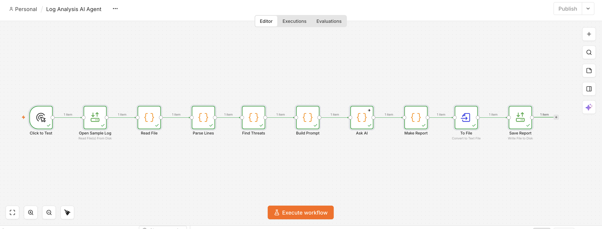

# Log Analysis AI Agent 

An n8n workflow that reads a security log file, flags suspicious lines, maps them
to MITRE ATT&CK techniques and writes an HTML incident report. A language model
adds a short plain-English summary at the top.

## Features

- Reads a plain-text log file and splits each line into time, level, part and message
- Nine detection rules covering brute force, malware, data exfiltration, SQL
  injection, privilege misuse, port scanning and monitoring tampering
- Every finding carries a MITRE ATT&CK technique ID and a severity of high,
  medium or low
- A Gemini-written summary saying what happened, what is most urgent and what to
  do first, ending in a risk rating
- Produces `report.html` — count boxes and a colour-coded findings table
- Runs on one button click. No terminal, no upload step

## Requirements

- Docker 
- A Gemini API key 

## Installation

### 1. Get the files

    git clone <your-repo-url>
    cd log-analysis-ai-agent

### 2. Add your API key

    cp .env.example .env

Open `.env` and paste your key after the `=`:

    GEMINI_API_KEY=your-key-here

### 3. Start n8n

    docker compose up -d

Open http://localhost:5678. First run asks you to create a local owner account —
that stays on your machine.

### 4. Import the workflow

In n8n: **⋯** menu → **Import from File** → pick `workflow.json`.

## Workflow Architecture

    Click to Test  →  Open Sample Log  →  Read File  →  Parse Lines  →  Find Threats
                   →  Build Prompt  →  Ask AI  →  Make Report  →  To File  →  Save Report

| Node | What it does |
|---|---|
| **Click to Test** | Manual trigger — starts the run |
| **Open Sample Log** | Reads `sample.log` from the project folder |
| **Read File** | Turns the file into a list of lines |
| **Parse Lines** | Splits each line into time, level, part, message; counts by level and part |
| **Find Threats** | Runs the rules, attaches MITRE IDs and severities |
| **Build Prompt** | Writes the question for the model from the findings |
| **Ask AI** | Calls Gemini and returns the summary |
| **Make Report** | Builds the HTML page |
| **To File** | Turns the HTML into a file named `report.html` |
| **Save Report** | Writes it to the project folder |

## Usage

### Analyzing Log Files

Click **Execute workflow** in n8n. It takes roughly 30 seconds — most of that is
the model thinking.

To analyse a different file, drop it in the project folder and change the path in
the **Open Sample Log** node.

### Output

`report.html` appears in the project folder, overwritten on each run. Open it in
any browser. It contains:

- the AI summary and risk rating
- counts: threats found, high, medium, low
- a table of every finding with time, threat, severity, MITRE ID and the log line

Nothing is sent anywhere except the findings, which go to Google's API for the
summary. The raw log never leaves your machine.

## License

MIT

